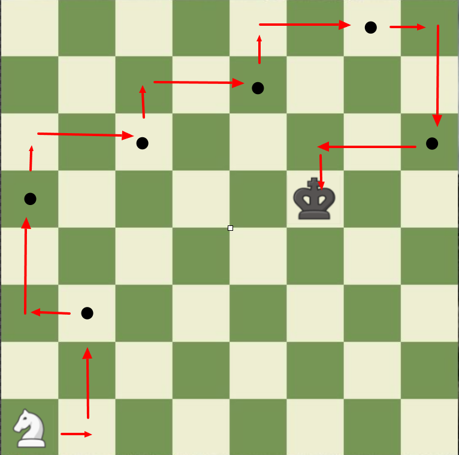
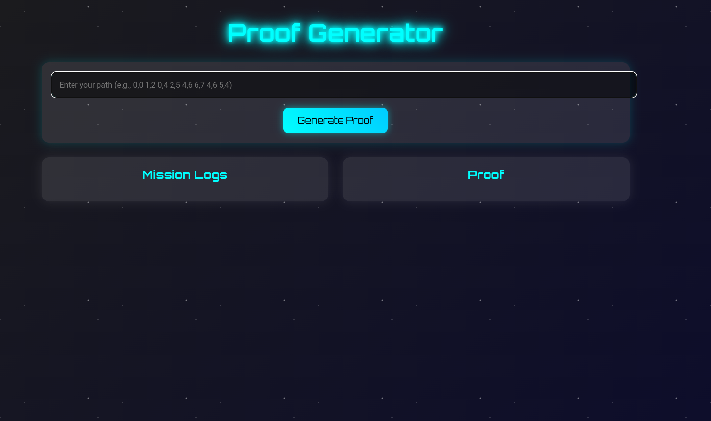

# ZK Proofs: A Knight's Path

This project is a Zero Knowledge Proof (ZKP) implementation developed as part of the final project for the Encode Zero Knowledge Bootcamp. It demonstrates the use of ZKP in a chess-like scenario, showcasing the ability to prove knowledge of a solution without revealing the solution itself.

## Project Overview
The premise of this project is based on a chess scenario:

- We have an 8x8 chess board.
- A knight piece starts at the bottom left corner (position 0,0).
- A king is placed at a known position on the board.
- The prover (player) must move the knight to capture the king in exactly **8 moves**. 
- **NOTE**: starting from (0,0) is considered one move.
- The path taken by the knight is private information.

The goal of this Zero Knowledge Proof is to prove that the prover knows a valid path for the knight to capture the king in exactly 8 moves, without revealing the actual path taken.

<p align="center">
  
</p>

## Technical Details
This project is implemented using Noir, a domain-specific language for writing zero-knowledge proofs. The main components of the proof system are:

1. **Prover**: Generates a proof of knowing a valid path.
2. **Verifier**: Verifies the proof without learning the path.
3. **Public Inputs**: The starting position of the knight (always 0,0) and the position of the king.
4. **Private Inputs**: The path taken by the knight (represented as an array of 8 moves).

The proof ensures:

- The knight starts at (0,0) and ends at the king's position.
- All moves are valid knight moves.
- The path consists of exactly 8 moves.
- All positions are within the 8x8 board.

## Project Structure
```
├── asset
│   └── path.png
├── circuit
│   ├── Nargo.toml
│   ├── proofs
│   └── src
├── frontend
│   └── ...code for UI
└── README.md
```

- ```Nargo.toml```: Configuration file for the Noir project.
- ```proofs/```: Directory containing generated proofs.
- ```src/```: Source code directory.
  - ```board.nr```: Contains the logic for validating the knight's path.
  - ```main.nr```: The main entry point of the program.
  - ```tests/```: Directory for test files.
  - ```tests.nr```: Contains test cases for the project.
- ```frontend```: Code for user interface

## Code Explanation

### main.rs
```rust
mod board;
mod tests;
fn main(
    king: pub board::Square,
    path: [board::Square; 8]
) {
    board::is_valid_path(path, king);
}
```
This is the main entry point of the program. It takes two inputs:

```king```: A public input representing the king's position.
```path```: A private input representing the knight's path as an array of 8 squares.

The ```main``` function calls ```is_valid_path``` from the ```board``` module to verify the path.


### board.nr
This file contains the core logic for validating the knight's path. Key points:

1. ```Square struct```: Represents a position on the chess board.
2. ```is_valid_path function```: Validates the entire path of the knight.
  - Checks if the start and end positions are correct.
  - Ensures all moves are within the board boundaries.
  - Verifies that each move is a valid knight move.

The validation process uses assertions to enforce the rules, which is crucial for the zero-knowledge proof generation.

## How to Run

To install Noir, open a terminal on your machine, and write:
```bash
curl -L https://raw.githubusercontent.com/noir-lang/noirup/main/install | bash
```
Close the terminal, open another one, and run
```bash
noirup
```
Clone this repository and change into the directory
```bash
https://github.com/ksmit323/zk_bootcamp_project.git
cd zk_bootcamp_project
```
Compile the program and from there you can genarate the proof and verify it
```rust
nargo compile
nargo prove
nargo verify
```

## Testing

The project includes a test file (tests.nr) and test cases (valid_path_test_1.nr). To run the tests:
```rust
nargo test
```

## How to Run the UI

<p align="center">
  
</p>

### Prerequisites
Before you begin, ensure you have the following installed:
- [Node.js](https://nodejs.org/) (which includes npm)

### Setup Instructions

1. Follow the instructions above for setting up Noir

2. Change into the ```frontend``` directory:
```bash
cd zk_bootcamp_project/frontend
```
3. Install Dependencies
```bash
npm install
```
4. Run the development server
```bash
npm run dev
```

### Using the UI

1. **Open the UI**
  - Once the development server is running, open your web browser and navigate to http://localhost:3000 (or the URL provided in the terminal).

2. **Generate Proof**
  - Enter your path in the input box provided. The path should be in the format: 0,0 1,2 0,4 2,5 4,6 6,7 4,6 5,4
  - Click on the Generate Proof button.

3. **View Mission Logs and Proof**
  - The "Mission Logs" section will display logs related to the proof generation process.
  - The "Proof" section will show the generated proof.

4. **Verify Proof**
  - After generating the proof, click on the Verify Proof button to verify the proof.
  - The logs will display the status of the verification process.

### Additional Notes
- Make sure your input path consists of exactly 8 coordinate pairs, each in the format x,y with a space in between each coordinate.
- If there are any issues or errors during the proof generation or verification, they will be displayed in the "Mission Logs" section.

### Troubleshooting
- Server Not Starting: Ensure you are in the correct directory (zk_bootcamp_project/frontend) and have run ```npm install``` before ```npm run dev```.
- Missing Dependencies: If you encounter any missing dependency errors, try running ```npm install``` again to ensure all packages are correctly installed.
- UI Not Loading: Make sure there are no errors in the console where you ran ```npm run dev```. Check the browser console for any JavaScript errors as well.

## Future Improvements
Potential areas for enhancement:

- Implement more complex chess scenarios.
- Optimize the proof generation for larger board sizes.
- Enhance the front-end interface to visualize the proof process.

## Conclusion
This project demonstrates the power of Zero Knowledge Proofs in creating verifiable claims without revealing sensitive information. By proving the existence of a valid knight's path without disclosing the path itself, we can showcase a practical application of ZKP in game-like scenarios.  This project was inspired by the quests in Node Guardians.  I would like to thank the organizers of the bootcamp, Encode and the instructors from Extropy. 

